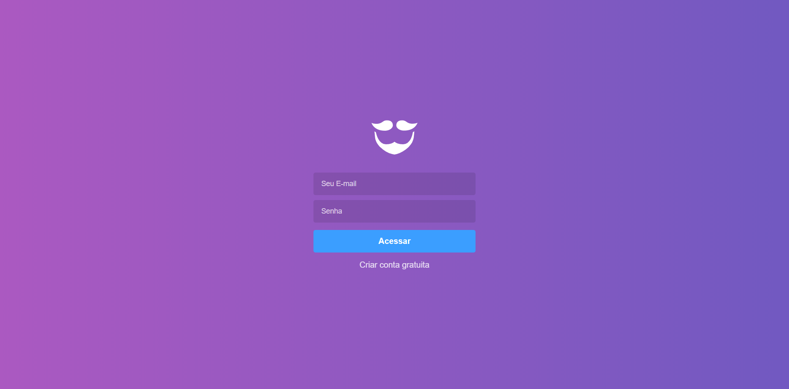
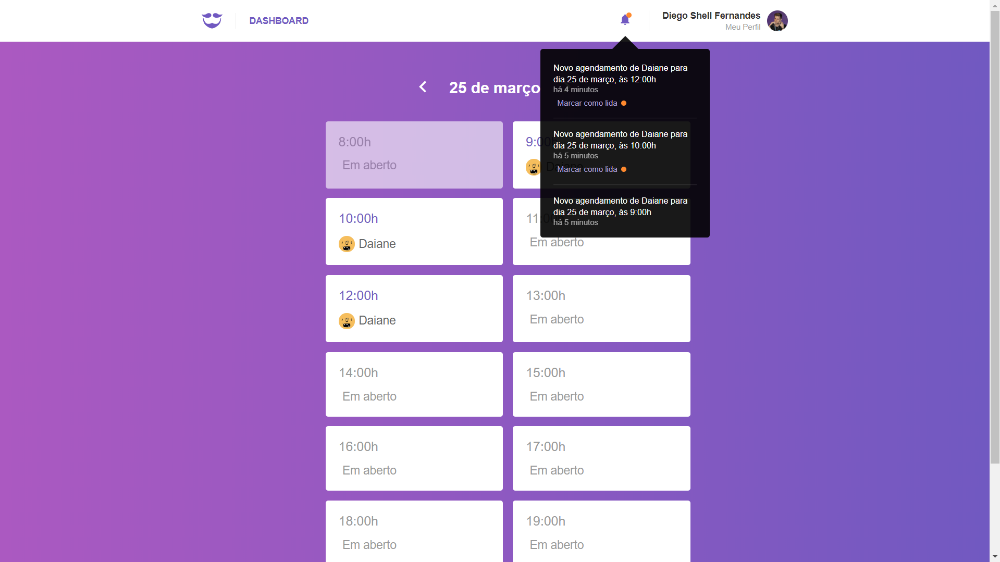
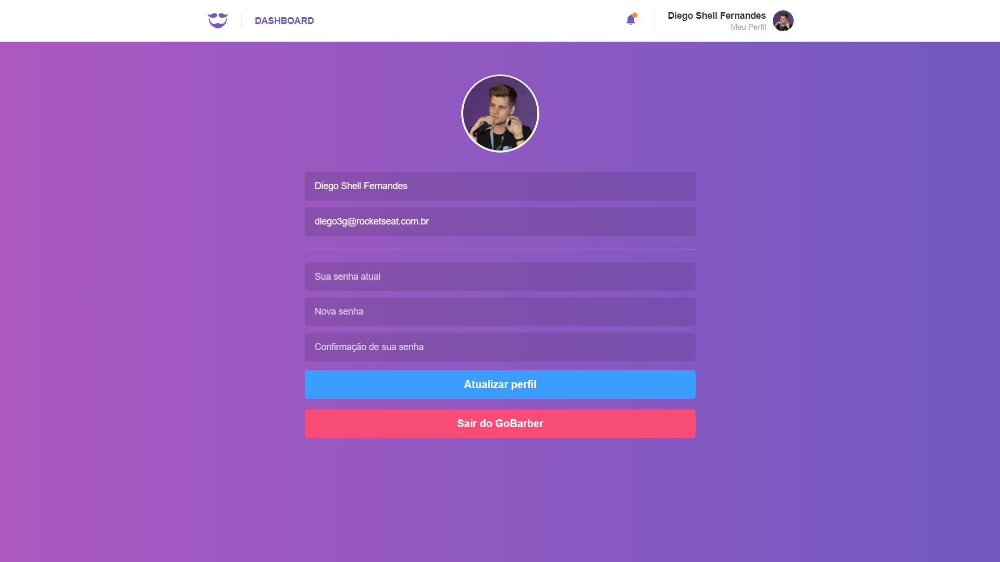

<h1 align="center">
    
</h1>

<h3 align="center">
  💈🪒 GoBarber 🧔💜
</h3>

  <a href="#rocket-sobre-o-desafio">Sobre</a>&nbsp;&nbsp;&nbsp;|&nbsp;&nbsp;&nbsp;
  <a href='#gear-oque-foi-utilizado'>Oque foi utilizado</a>&nbsp;&nbsp;&nbsp;|&nbsp;&nbsp;&nbsp;
  <a href="#camera-imagens">Imagens</a>&nbsp;&nbsp;&nbsp;|&nbsp;&nbsp;&nbsp;
  <a href="#Instalar e usar">Instalar e usar</a>

## 💈 Sobre

 O gobarber é um sistema para agendamentos de serviços de beleza, e o web site é para os provedores de serviço.  Web desenvolvido de reactJS.

## ⚙️ Oque foi utilizado
<ul>
  <li>UnForm</li>
  <li>React</li>
  <li>React hooks</li>
  <li>Redux</li>
  <li>Redux Persist</li>
  <li>Redux Saga</li>
  <li>Select</li>
  <li>Axios</li>
  <li>date-fns</li>
  <li>immer</li>
  <li>polished</li>
  <li>yup</li>
</ul>

## 📷 Imagens

<strong>Login</strong>

 
<strong>Agendamentos</strong>

 
<strong>Perfil do provedor.</strong>

## 🚀 Instalar e usar

###### Clone o respostiorio.
``git clone git@github.com:nelsonplinio/gobarber-frontend.git``

###### Instalar as dependencias.
``cd gobarber-frontend ``
`` yarn ou npm install``

###### Instalar as dependencias.
``yarn start ou npm run start ``
